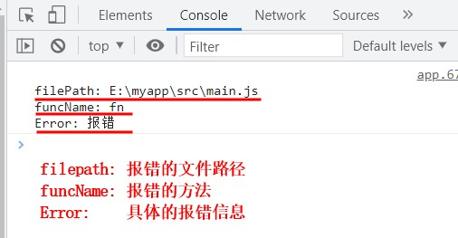

## babel-plugin-await-add-trycatch

一个自动给 async/await 函数添加 try/catch 的 babel 插件

### 安装

```shell
npm install --save-dev babel-plugin-await-add-trycatch
```

### 使用说明

babel.config.js 配置如下

```javascript
module.exports = {
  plugins: [
    [
      require('babel-plugin-await-add-trycatch'),
      {
        exclude: ['build'], // 默认值 ['node_modules']
        include: ['main.js'], // 默认值 []
        customLog: 'My customLog' // 默认值 'Error'
      }
    ]
  ]
};
```

### demo

#### 原始代码：

```javascript
async function fn() {
  await new Promise((resolve, reject) => reject('报错'));
  await new Promise((resolve) => resolve(1));
  console.log('do something...');
}
fn();
```

#### 使用插件转化后的代码：

```javascript
async function fn() {
  try {
    await new Promise((resolve, reject) => reject('报错'));
    await new Promise((resolve) => resolve(1));
    console.log('do something...');
  } catch (e) {
    console.log('\nfilePath: E:\\myapp\\src\\main.js\nfuncName: fn\nError:', e);
  }
}
fn();
```

#### 打印的报错信息：


